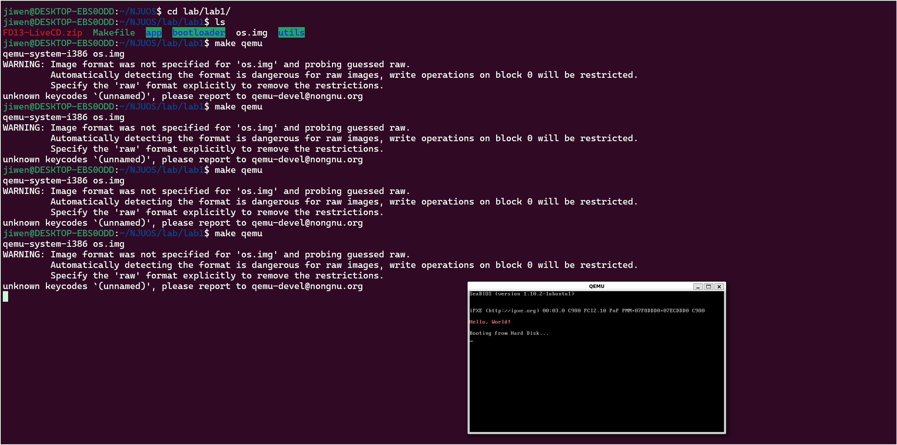

# <div align="center">NJUOS</div>

> Motiation: revisit njuos lab with wsl2 and organise related materials


<details open>
<summary>Prerequiste</summary>


install wsl2 and install ubuntu18.04

```bash
sudo apt-get update
sudo apt-get install qemu-system-x86
sudo apt-get install qemu-system-i386
sudo apt-get install vim
sudo apt-get install gcc
sudo apt-get install binutils
sudo apt-get install make
sudo apt-get install perl
sudo apt-get install git
```

如果有同学使用的是amd64架构，且在代码中使用了标准库，`gcc`使用`-m32`编译选项时需要进行额外配置

第一步：确认64位架构的内核

```
dpkg --print-architecture
amd64
```

第二步：确认打开了多架构支持功能

```
dpkg --print-foreign-architectures
i386
```

说明已打开，否则需要手动打开

```
sudo dpkg --add-architecture i386
sudo apt-get update
sudo apt-get dist-upgrade
```

这样就拥有了64位系统对32位的支持

安装gcc multilib

```
apt-get install gcc-multilib g++-multilib
```

gdb对Ubuntu18.04的版本支持只到8.X，而实验需要gdb 10.0+，需要手动编译并安装gdb

```
apt-get install libncurses5-dev
wget -c https://ftp.gnu.org/gnu/gdb/gdb-10.1.tar.xz
xz -d gdb-10.1.tar.xz
tar -xvf gdb-10.1.tar
cd gdb-10.1/
./configure --enable-tui
make -j32
make install
```

安装成功后，执行

```
gdb -v
```

版本应显示`10.1`


install [xtiming](https://sourceforge.net/projects/xming/) or `wsl --update` to support graphical applications.
reference:
1. https://superuser.com/questions/1580610/how-to-run-gui-apps-with-windows-subsystem-for-linux
2. https://stackoverflow.com/questions/71408331/no-available-video-device-error-with-sdl2

After all the Prerequiste you can test it:
```
cd lab1
make clean
make qemu
```
If you see the following result, foe now you have all the necessity for the following labs.
<div align="left">
  
</div>


</details>

<details open>
<summary>Lab1</summary>
</details>
